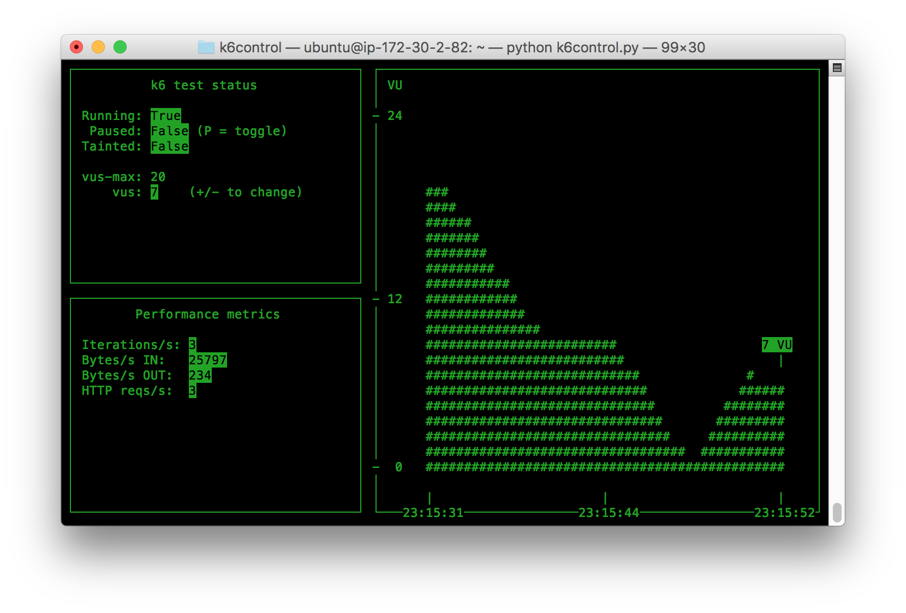

# k6control
A command-and-control UI for k6

<p align="center"></p>

## Usage

Start k6control and connect to a locall
```
$ k6 run --quiet --linger script.js >/dev/null &
$ python k6control.py -a localhost:6565
```

## k6control options

```
$ python k6control.py -h
Usage: k6control [options]

Options:
 -a <k6_address>                Specify where the running k6 instance
    --address=<k6_address>      is that we want to control
 -i <seconds>                   How often should k6control refresh data
    --interval=<seconds>        and plot new points in the VU graph
 -v <vus>                       How many VUs to add or remove when using
    --vumod=<vus>               the +/- controls to add or remove VUs
 -h                             Show this help text
    --help
```
